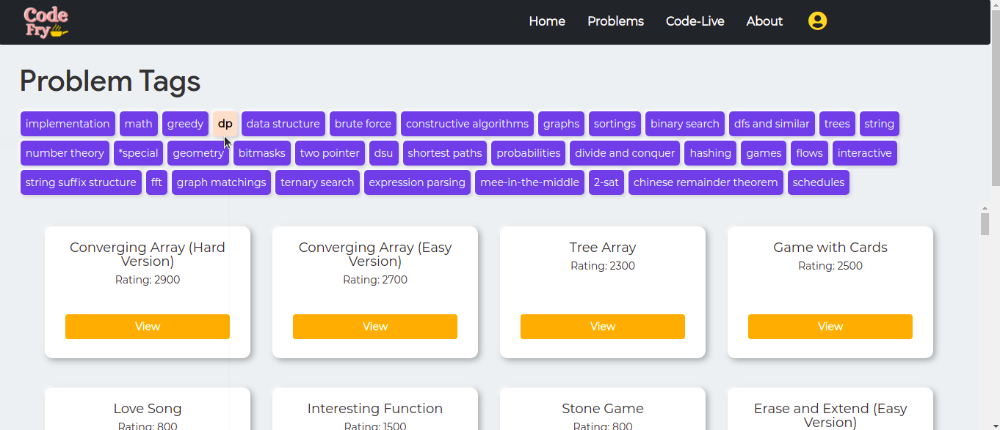
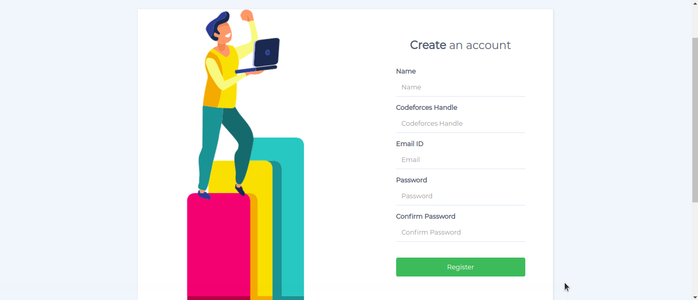
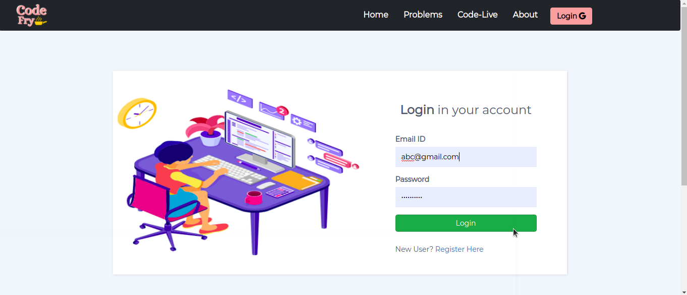
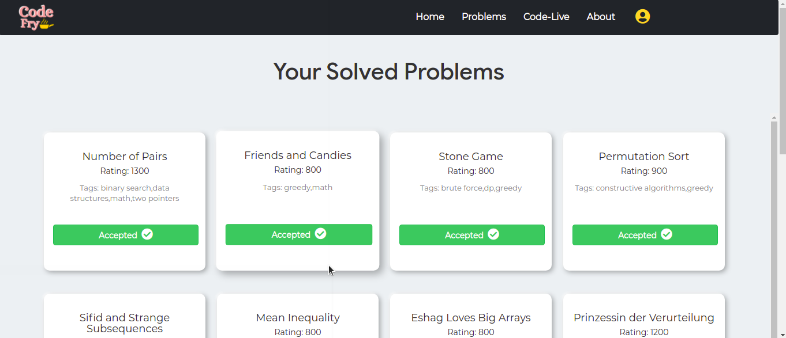
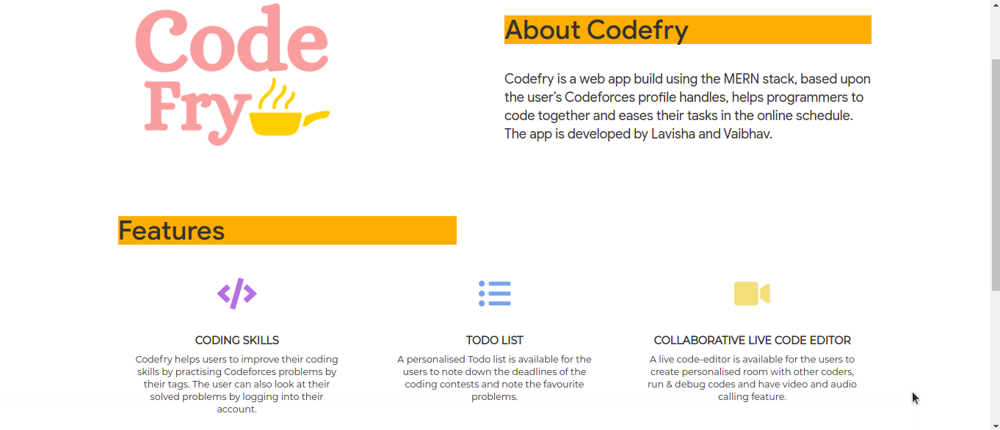
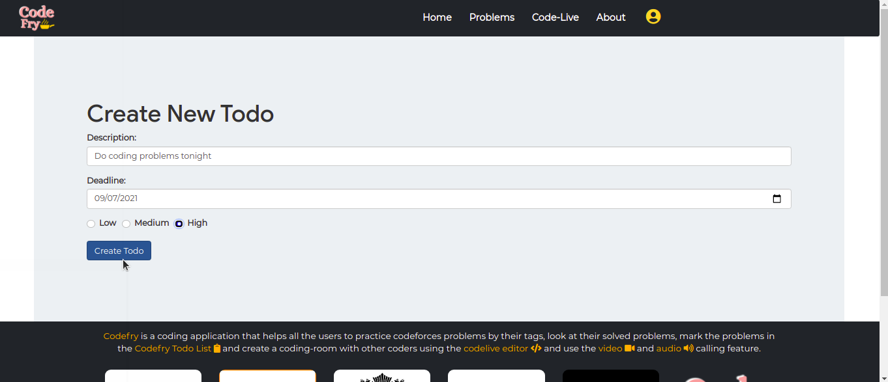
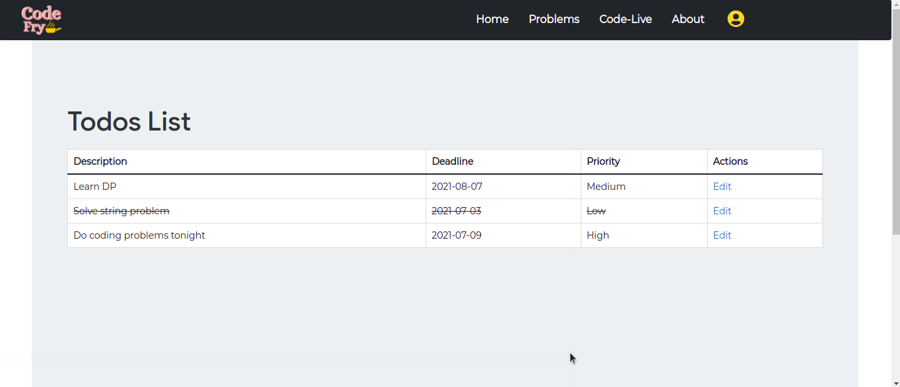
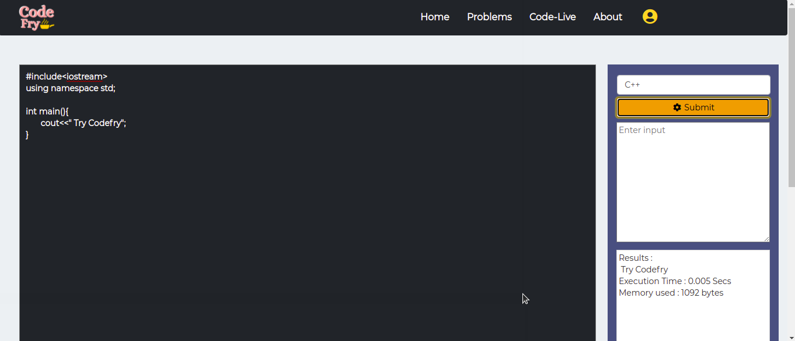

# CODEFRY - A Programming Community Application

 

## Inspiration:
Considering the present condition due to Covid-19, distant and remote learning has been of everyone's life. We wanted to give it a try from our end to address the issues faced by programmers in a simpler way.

Using the most powerful weapon with humanity - technology, we decided to solve the issue by introducing Codefry Application. It is a MernStack Web Application, based upon the user’s Codeforces profile handles, helps programmers to code together and eases their tasks in the online schedule.

 

## Technology Stack:
- **Frontend** - React  
- **Backend** - Express.js, Node.js  
- **Database** - MongoDB  
- **Other tools & technologies** - Web APIs, Socket.IO  

## Setup (APIs used)
Following APIs are required to run this web app:

- [Codeforces Problem Set API](https://codeforces.com/api/problemset.problems?tags=implementation)
- [Codeforces User Status API](https://codeforces.com/api/user.status?handle=Fefer_Ivan&from=1&count=10)

## Instructions
#### Environment Variables
- Place the API keys in `.env` with your own

### Install dependencies

  
<strong>To setup backend and run server locally:</strong>

- `cd server` - to switch to codefry backend
- `npm install` - to install all the backend packages
- `node index.js` - to run the server

  
<strong>To setup frontend and run server locally:</strong>

	
- `cd codefry` - to switch to codefry frontend
- `npm install` - to install all the frontend packages
- `npm start` - to start the client

  
<strong>To run the Video Meet and Drawing board:</strong>

	
- `cd CodeFry-Video-Meet` - to switch to codefry Video-meet & drawing Board
- `npm install` - to install all the socket.io, WebRTC packages

  
<strong>To run the local database:</strong>
 
	
- `mongod` - to run local database 

## Features:
  #### Main Features
  - [x] **Programming skills** - Codefry helps users to improve their coding skills by practising Codeforces problems by their tags.  
  - [x] **Tags based problems** - Users can also look at all the Codeforces problems on the basis of problem tags (ex-array, dp, greedy, etc.)  
  - [x] **Login and Signup Authentication** - Every user has to create his/her account to access personalised features.  
  - [x] **Codeforces solved problems** - The user can also look at their solved problems by logging into their account & putting the Codeforces handle. 
  - [x] **Coding rooms** - Users can create personalised coding room with other coders. 
  - [x] **Code Editor** - A code editor is also present for the user to run the code in four languages - C, C++, Python and Java. 

## ScreenShots:

- ### Problems by their tags:

 

- ### Register:

 

- ### Login:

 

- ### Solved Problems:

 

- ### About:

 

- ### Create your Tasks:

 

- ### Task list:

 

- ### Code Editor:

 
